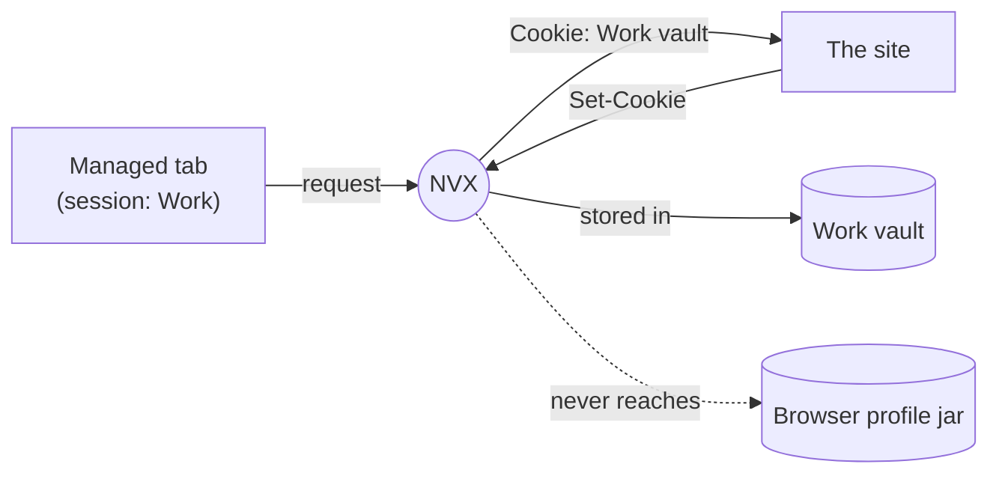

# NVX Session

**Every account you own, logged in at the same time, in one window. A separate login per tab.**

Sign into work in one tab and personal in the next. Both stay logged in. Neither
can see the other. No profile switching, no incognito window that forgets you the
second you close it, no second browser eating half your RAM.


Site and downloads: **[session.nvx.sh](https://session.nvx.sh)**

---

## The problem

You're signed into your work Google and your personal Google at the same time. A
coworker sends a calendar link. You click it.

> **It opens as your personal account.**

Now you're requesting access to a doc you already own, or you reply from the wrong
address before you catch it. Google picked a default for you, and it picked wrong,
because nothing tells it which "you" is driving this tab.

It's not just Google. It's the client's Slack and yours. Staging AWS and prod. Two
GitHub accounts. A test user and an admin user for the app you're literally
building. Browsers were built for one person with one life, and most of us are
neither.

The usual fixes all cost you something:

- **A second Chrome profile:** a whole separate window, ~250 MB, and you're alt
  tabbing between two browsers all day.
- **Incognito:** forgets everything the second you close it, and gives you exactly
  one extra identity, not five.
- **Signing out and back in:** the exact thing you're trying to stop doing.

NVX keeps everything in the one window you already work in, and lets the *tab*
decide who you are instead of the browser.

---

## How it compares

| Tool | What it is | Stays in your browser | A login per tab | Controls fingerprint | RAM per account |
|---|---|:--:|:--:|:--:|:--:|
| **NVX Session** | Extension, swaps cookies per request | **Yes** | **Yes** | **Yes** \* | **~0 MB** |
| Chrome / Edge profiles | Built in, one window each | Separate window | No | No | ~250 MB |
| Incognito | Built in, temporary | Yes, but amnesiac | One extra only | No | ~150 MB |
| Firefox Containers | Engine level, Firefox only | Firefox only | Yes | No | ~0 MB |
| SessionBox and clones | Extension, cookie swapping | Yes | Yes, but fragile | No | low |
| Anti detect browsers | A patched browser per profile | No, you leave | Yes | Strongest | 300-800 MB |

\* Free ships a shared, normalised machine profile. Per-session personas, a
distinct and self-consistent fingerprint for each login, are the paid tier.

Two kinds of tool exist today: session managers that ignore your fingerprint, and
anti detect browsers that make you leave the browser you work in. NVX does both
jobs at once. Many identities, in your real browser, with the fingerprint under
your control.

It isn't magic. If you live in Firefox, Multi-Account Containers isolates deeper
and it's free. NVX is for the rest of us stuck in a Chromium browser, where that
door is locked.

---

## What it does

A browser keeps one cookie jar per profile. Every tab drinks from it, which is
exactly why signing into a second account on a site logs you out of the first.

NVX gives each session its own jar, and decides, for every request, which jar that
request gets to see. A tab belongs to a session, so its requests carry that
session's cookies and nothing else. Your browser's own jar never reaches a managed
tab.

That's the whole idea. Everything else is a consequence of it.

### What it isn't

- **Not anonymity.** Sites still see your IP, your browser, your screen. Sessions
  are separate from *each other*, not hidden from the *site*.
- **Not a sandbox.** A page can still do anything a page can do. What's isolated is
  identity, not capability.
- **Not a password manager.** It keeps you logged in as somebody. It has no idea
  who they are or what their password is.

---

## First run

Install it onto a browser you've used for years and it opens one screen, once.

It reads what your profile is already carrying, ranks each thing by how much it
looks like a real logged-in account rather than a leftover preference cookie, and
groups the sites that belong to one account together. A university login covering
the portal, the sign-in page and the learning system shows up as *one* proposal,
not three.

Tick what you want. Press once. Each proposal becomes a session, its cookies get
copied in, and the tabs you already have open on those sites slide into it without
reloading, because the cookies are identical.

Nothing happens before that button, and nothing is destroyed by it. Adoption
**copies**, so your browser's own jar is exactly as it was afterward, every
unmanaged tab keeps working, and undoing the whole thing is just deleting a
session. **Not now** is a real answer, and it lives behind *Sessions › Set up from
profile* whenever you want it back.

When it isn't sure whether two logins are one account or two, it offers *more*
sessions rather than fewer. Merging two accounts into one session is the single
failure this whole product exists to prevent.

---

## Using it

The toolbar button is the whole product. It opens on **home**: who this tab is
signed in as right now, and a one-press switch to anyone else.

- **Home:** the session this tab is in, and every session you could move it to.
  Press a row and the tab rebinds and reloads as that identity. Nothing reaches the
  site until you press. Three honest readings sit at the bottom: whether isolation
  is `clean`, how many trackers got cookies, how many tabs are managed.
- **Sessions:** make one, name it, colour it, and *pin* the domains it's for. A
  domain only one session claims binds new tabs automatically. A domain two
  sessions claim gets *asked about* instead of guessed.
- **Tabs:** every open tab, which session it's in, and a picker to move it.
- **Trail:** requests with a blast radius, like deletes and terminations, anything
  that can destroy something. Each session picks what to do: *warn* in the page, or
  *refuse* the request outright and let you allow that one endpoint for five
  minutes.
- **Parties:** who else was on the pages your sessions visited. New sessions
  **block** third-party cookies by default, because a session exists to be
  separate. This doesn't break single sign-on, and there's a test that keeps it
  that way.
- **Storage:** cookies are only half an identity. Sites that keep their token in
  `localStorage` need the storage shim to reach the page, so this says plainly
  which origins are isolated and which are running through untouched. An honest
  "shared" beats a settings screen that lies.
- **Journal:** what the extension did, kept on disk, so it outlives the console
  getting wiped by a restart. No cookie values, no request bodies, no query
  strings. Query strings are *removed*, not filtered, because that's where sign-in
  codes and reset tokens travel.
- **Settings:** the **fingerprint** posture. *Mirror* leaves your real machine
  untouched and is the default, because looking incoherent is louder than looking
  common. *Standardize* puts everyone on one shared, normalised machine. *Persona*
  gives each session its own self-consistent machine, and that's the paid tier.

When a navigation genuinely can't be resolved, because you're heading to a domain
two sessions both cover, the tab is **held**. It shows a picker instead of the
site, and the site isn't contacted at all until you answer. That matters: a
federated login redirects to its identity provider within a second, and asking
*over* the page loses the race every time.

---

## Install

Grab the latest build from **[session.nvx.sh/download](https://session.nvx.sh/download)**,
or build it yourself:

```
npm install
npm run build          # produces dist/
```

Either way, in the browser: open the extensions page, turn on developer mode,
choose **Load unpacked**, and pick the `dist` folder.

Anything on **Chromium 128 or newer** runs it: Chrome, Edge, Opera, Opera GX,
Brave. There's also a Manifest V2 build (`npm run build:mv2`, into `dist-mv2/`) for
browsers that still refuse V3. It isolates cookies identically and gives up
web-storage isolation, which V2 can't express. The popup tells you which build
you're on.

---

## How it works

The interesting part is **request-side substitution**. Most session extensions
swap the browser's stored cookies in and out as you switch, which races the moment
two tabs are busy at once. NVX never touches the stored jar. It rewrites the
`Cookie` header on the request as it leaves and captures `Set-Cookie` on the way
back, keeping each session's cookies in its own vault and out of the profile jar
entirely.



Managed and unmanaged tabs share the window and never see each other's identity.
The full design, every rule and edge case and honest limit, lives in the Pro
repository's `DESIGN.html`. This README is the short version.

---

## Development

```
npm test               # unit tests
npm run typecheck
npm run build          # dist/,     Manifest V3
npm run build:mv2      # dist-mv2/, Manifest V2
npm run check          # every shipped script parses
npm run fixture        # the test origin on :8787
npm run e2e            # a real browser, against the fixture
```

`tools/` holds the dev helpers those commands use.

---

## Open core

NVX Session is **open core**. This repository is the free product under GPL-3.0,
and it's complete on its own. It builds and runs the free extension with no other
dependency.

The paid Pro features live in a separate private repository, mounted here as a git
submodule at `src/pro/`:

- cross-device sync of your session structure, end-to-end encrypted;
- per-session IndexedDB and Cache isolation;
- a coherent per-session fingerprint persona;
- exact per-request cookie control through the debugger.

That folder is **empty in a normal clone**. The build notices it's missing and
produces the free product, so `npm install && npm run build` works with no
submodule and no extra setup. Nothing in the free build depends on the Pro code,
and the free build ships none of it.

---

## Licence

GPL-3.0, see [`LICENSE`](LICENSE). The copyleft is deliberate: anyone who
distributes a modified build of the free product has to carry its source too.
